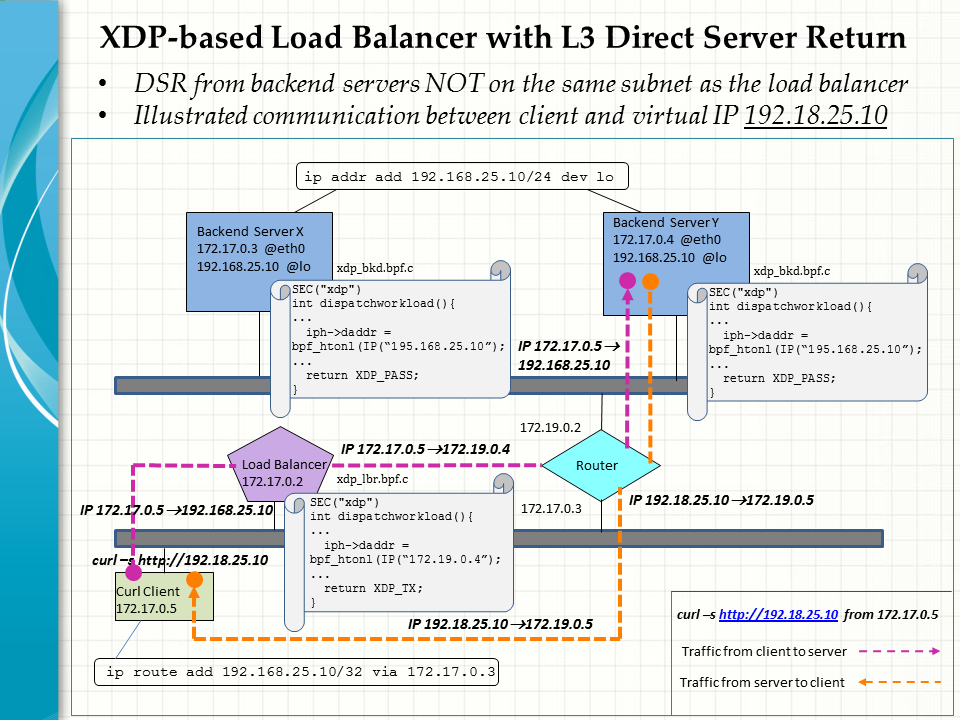

## Layer 3 DSR by XDP-based Load Balancer

This is a continuation of our work on XDP-based load balancing with direct server return (DSR), [(see here)](https://github.com/snpsuen/XDP_LBDSR_Enhance). In this particular use case, the backend servers are NOT located on the same subnet as the load balancer. In other words, they are more than one subnet or hop away from where the workloads are dispatched.

To this end, the data plane is implemented on a novel architecture that involves cooperation between two XDP bpf programs attached to the load balancer and backend servers respectively. The setup allows us to focus exclusively on the ingress traffic and thus make full use of the XDP hooks to fast-track workload redirection.



### Data Plane Architecture

The data plane is mainly drven by two distributed XDP bpf programs running in the kernel space of the load balancer and backend servers respectively. They work together to provide end to end clent/server communication for dispatch and delivery of workloads.
* Load balancer: xdp_lbr.epf
* Backend servers: xdp_bkd.ebf

(A) Key things done by <em> xdp_lbr.epf </em> at the load balancer upon recipt of the relevent packets
1. Select one of the backend servers
2. Rewrite the destinaton IP from the VIP to the selected server
3. Look up the next hop for the selected server in the FIB kenrel routing table
4. Forward the packets to the found next hop via XDP_TX

(B) Key things done by <em> xdp_bkd.epf </em> at the backend servers upon recipt of the relevent packets
1. Rewrite the destinaton IP from the selected server back to the VIP
2. Pass the packets to the network stack for the service endpoint to process via XDP_PASS

### Limitations

Our primary concern is to wire up the XDP hooks on the data plane in such a way that any VIP service traffic will be steered from a client to a desirable endpoint and back through a DSR path. At present, we opt to leave out the control plane and use bpftool intead to load and attach the XDP bpf programs on the systems concerned. Settings about the load balancer and backend servers are also hardcoded into the programs.

In this example, the backend servers are always selected randomly to process client requests. We stop short of trying other load balancing algorithms or criteria.

Finally, only IPv4 is considered in this use case. Nevertheless, we believe the architecture should apply equally well to IPv6.

### Environment Setup

The use case environment is set up as per the above diagram. Note that the load balancer is located on a different IP subnet from that of the backend server. In our POC lab, to speed up prototyping and testing, all the participating systems are deployed in the form of docker containers running on the same host.
* Load balancer lbdsr0a on the default subnet
* Curl client curlybox01 on the default subnet
* Router router0a attached to both the default and backend subnet
* Backend server backend0x on the backend subnet
* Backend Server backend0y on the backend subnet

### Implementation Walkthrough

Follow the steps below to set up the environment, build and test the XDP bpf programs. Here is a summary of IP addresses used in this example.
<table>
	<thead>
		<tr>
			<th scope="col">System/Network</th>
			<th scope="col">IP addresses</th>
		</tr>
	</thead>
	<tbody>
		<tr>
			<td>Default subnet</td>
			<td aligh="left">172.17.0.0/24</td>
		</tr>
		<tr>
			<td>Backend subnet</td>
			<td aligh="left">172.19.0.0/24</td>
		</tr>
    <tr>
			<td>lbdsr0a</td>
			<td aligh="left">172.17.0.2</td>
		</tr>
    <tr>
			<td>router0a</td>
			<td aligh="left">172.17.0.3<br>172.19.0.2</td>
		</tr>
    <tr>
			<td>curlybox01</td>
			<td aligh="left">172.17.0.4</td>
		</tr>
    <tr>
			<td>backend0x</td>
			<td aligh="left">172.19.0.3</td>
		</tr>
    <tr>
			<td>backend0y</td>
			<td aligh="left">172.19.0.4</td>
		</tr>
    <tr>
			<td>Virtual IP</td>
			<td aligh="left">192.168.25.10/24</td>
		</tr> 
	</tbody>
</table>

1. Create an additional docker subnet and run the containers for the load balancer, router, backend servers and client on a suitable Linux host.
```
docker run -d --privileged --name lbdsr0a -h lbdsr0a snpsuen/ebpf-xdp:v03
docker run -d --privileged --name router0a  -h router0a snpsuen/ebpf-xdp:v03
docker network create -d bridge backend-network 
docker network connect backend-network router0a	
docker run -d --privileged --name backend0x -h backend0x --network backend-network snpsuen/xdp-nginx:v01
docker run -d --privileged --name backend0y -h backend0y --network backend-network snpsuen/xdp-nginx:v01
docker run -d --privileged --name curlybox01 -h curlybox01 ferrgo/curlybox sleep infinity
```

2. Add routes to forward traffic between the default and backend subnet via router0a. 
```
docker exec lbdsr0a ip route add 172.19.0.0/24 via 172.17.0.3
docker exec curlybox01 ip route add 172.19.0.0/24 via 172.17.0.3
docker exec backend0x ip route add 172.17.0.0/24 via 172.19.0.2
docker exec backend0y ip route add 172.17.0.0/24 via 172.19.0.2
```

3. Configure L3 connectivity to the virtual IP.
```
docker exec backend0x ip addr add 192.168.25.10/24 dev lo
docker exec backend0y ip addr add 192.168.25.10/24 dev lo
docker exec curlybox01 ip route add 192.168.25.10/32 via 172.17.0.2
```

4. Build and run the XDP bpf program xdp_lbr.bpf on the load balancer.
```
docker exec -it lbdsr0a bash
git clone https://github.com/snpsuen/XDP_LBDSR_L3Backend
cd XDP*/Load*
make
```
Verify the program is attached in the xdpgeneric mode to the desirabe inteface of the load balancer.
```
root@lbdsr0a:/ebpf/xdp# ip -4 addr
1: lo: <LOOPBACK,UP,LOWER_UP> mtu 65536 qdisc noqueue state UNKNOWN group default qlen 1000
    inet 127.0.0.1/8 scope host lo
       valid_lft forever preferred_lft forever
12: eth0@if13: <BROADCAST,MULTICAST,UP,LOWER_UP> mtu 1500 xdpgeneric/id:217 qdisc noqueue state UP group default  link-netnsid 0
    inet 172.17.0.2/16 brd 172.17.255.255 scope global eth0
       valid_lft forever preferred_lft forever
```

5. Build and run the XDP bpf program xdp_bkd.bpf on both the backend servers.
```
docker exec -it backend0x bash
git clone https://github.com/snpsuen/XDP_LBDSR_L3Backend
cd XDP*/Back*
make
```
Verify the program is attached in the xdpgeneric mode to the desirabe inteface of the backend servers.
```
root@backend0x:/ebpf/xdp/XDP_LBDSR_L3Backend/Backend# ip -4 addr
1: lo: <LOOPBACK,UP,LOWER_UP> mtu 65536 qdisc noqueue state UNKNOWN group default qlen 1000
    inet 127.0.0.1/8 scope host lo
       valid_lft forever preferred_lft forever
    inet 192.168.25.10/24 scope global lo
       valid_lft forever preferred_lft forever
20: eth0@if21: <BROADCAST,MULTICAST,UP,LOWER_UP> mtu 1500 xdpgeneric/id:224 qdisc noqueue state UP group default  link-netnsid 0
    inet 172.19.0.3/16 brd 172.19.255.255 scope global eth0
       valid_lft forever preferred_lft forever
```

6. Test it out by sending an HTTP request curl -s http://192.18.25.10 in a loop to the virtual IP from the curl client.
```
docker exec curlybox01 sh
while true
> do
> curl -s http://192.168.25.10
> sleep 3
> done
```
Verify the requests are processed randamly by the two backend servers in a loop.
```
/ # while true
> do
> curl -s http://192.168.25.10
> sleep 3
> done
Server address: 192.168.25.10:80
Server name: backend0y
Date: 11/Jan/2024:15:10:15 +0000
URI: /
Request ID: ba940d016ddc3e886f62897a3666b9d2
Server address: 192.168.25.10:80
Server name: backend0y
Date: 11/Jan/2024:15:10:18 +0000
URI: /
Request ID: 8715fd6b274f86500bc55820aea34e77
Server address: 192.168.25.10:80
Server name: backend0x
Date: 11/Jan/2024:15:10:21 +0000
URI: /
Request ID: 22f3aea79f1c680eb7436a6dcf5236bd
Server address: 192.168.25.10:80
Server name: backend0x
Date: 11/Jan/2024:15:10:25 +0000
URI: /
Request ID: 5325d56fa9f66ce36749a4ba50938cff
Server address: 192.168.25.10:80
Server name: backend0y
Date: 11/Jan/2024:15:10:28 +0000
URI: /
Request ID: 8afed8da91660592a36976731c371a70
Server address: 192.168.25.10:80
Server name: backend0x
Date: 11/Jan/2024:15:10:31 +0000
URI: /
Request ID: f5f4b8f65f78b07b98f6cdc018959bd1
Server address: 192.168.25.10:80
Server name: backend0y
Date: 11/Jan/2024:15:10:34 +0000
URI: /
.....
```

7. Finally, you may find it useful to open the kernel tracing pipe on the Linux host and keep track of the bpf_printk messages from the XDP bpf programs.
```
keyuser@ubunclone:~$ sudo cat /sys/kernel/debug/tracing/trace_pipe

           <...>-7317    [002] dNs11  2027.743106: bpf_trace_printk: Added a new entry to the forward flow table for the backend ID 4
           <...>-7317    [002] dNs11  2027.743126: bpf_trace_printk: Packet is to be dispatched to the backend IP Q1: 172
           <...>-7317    [002] dNs11  2027.743127: bpf_trace_printk: Packet is to be displatched the backend IP Q1.19.0.4

           <...>-7317    [002] dNs11  2027.743131: bpf_trace_printk: Looked up relevant information in the FIB table with rc 0
           <...>-7317    [002] dNs11  2027.743132: bpf_trace_printk: Found fib_params.dmac[0-2] = 2:42:ac
           <...>-7317    [002] dNs11  2027.743133: bpf_trace_printk: Found fib_params.dmac[3-5] = 11:0:3

           <...>-7317    [002] dNs11  2027.743134: bpf_trace_printk: Found fib_params.smac[0-2] = 2:42:ac
           <...>-7317    [002] dNs11  2027.743135: bpf_trace_printk: Found fib_params.smac[3-5] = 11:0:2

           <...>-7317    [002] dNs11  2027.743136: bpf_trace_printk: Found FIB nexthop IP Q1: 172
           <...>-7317    [002] dNs11  2027.743137: bpf_trace_printk: Found FIB nexthop IP Q1.17.0.3

           <...>-7317    [002] dNs11  2027.743137: bpf_trace_printk: Found FIB ifindex 12

           <...>-7317    [002] dNs11  2027.743139: bpf_trace_printk: Before XDP_TX, packet is to be transported from the source IP Q1: 172
           <...>-7317    [002] dNs11  2027.743140: bpf_trace_printk: Before XDP_TX, packet is to be transported from the source IP Q1.17.0.4

           <...>-7317    [002] dNs11  2027.743141: bpf_trace_printk: To the destination IP Q1: 172
           <...>-7317    [002] dNs11  2027.743142: bpf_trace_printk: To the destination IP Q1.19.0.4

           <...>-7317    [002] dNs11  2027.743143: bpf_trace_printk: Before XDP_TX, from the source MAC 2:42:ac:xx:xx:xx
           <...>-7317    [002] dNs11  2027.743144: bpf_trace_printk: Before XDP_TX, from the source MAC xx:xx:xx:11:0:2

           <...>-7317    [002] dNs11  2027.743145: bpf_trace_printk: To the destination MAC 2:42:ac:xx:xx:xx
           <...>-7317    [002] dNs11  2027.743146: bpf_trace_printk: To the destination MAC xx:xx:xx:11:0:3

           <...>-7317    [002] dNs11  2027.743146: bpf_trace_printk: Returning XDP_TX...
           <...>-7317    [002] dNs11  2027.743241: bpf_trace_printk: Backend>> Packet is to be dispatched to the backend IP Q1: 192
           <...>-7317    [002] dNs11  2027.743243: bpf_trace_printk: Backend>> Packet is to be dispatched to the backend IP Q1.168.25.10

```


