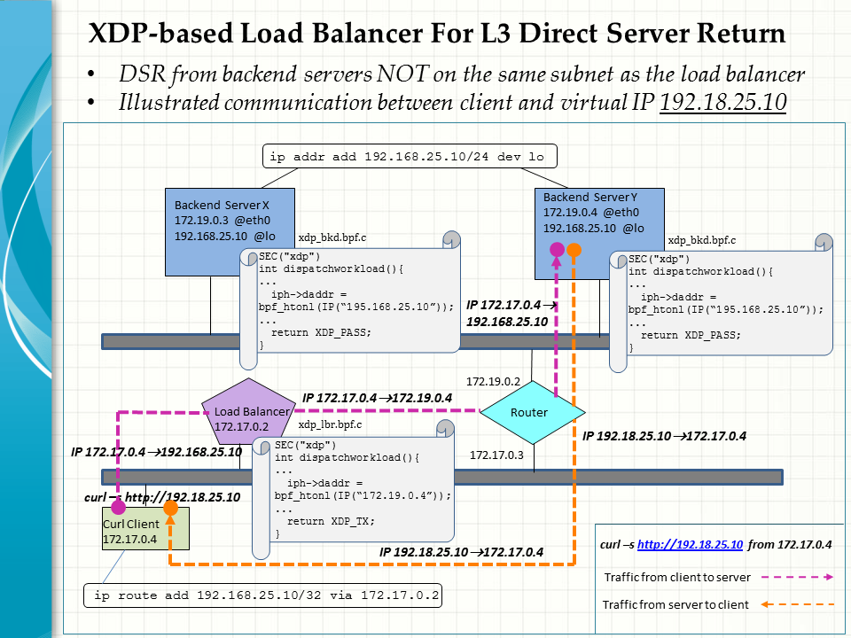

## Layer 3 DSR by XDP-based Load Balancer

This is a continuation of our work on XDP-based load balancing with direct server return (DSR), [(see here)](https://github.com/snpsuen/XDP_LBDSR_Enhance). In this particular use case, the backend servers are NOT located on the same subnet as the load balancer. In other words, they are more than one subnet or hop away from where the workloads are dispatched.

To this end, the data plane is implemented on a novel architecture that involves cooperation between two XDP bpf programs attached to the load balaner and backend servers respectively. The setup allows us to focus excluively on the ingress traffic and thus make full use of the XDP hooks to fast-track workload redirection.

### Data Plane Architecture

The data plane is mainly drven by two distributed XDP bpf programs running in the kernel space of the load balancer and backend servers respectively. They work together to provide end to end clent/server communication for dispatch and delivery of workloads.
* Load balancer: xdp_lbr.epf
* Backend servers: xdp_bkd.ebf

(A) Key things done by <em> xdp_lbr.epf </em> at the load balancer upon recipt of the relevent packets
1. Select one of the backend servers
2. Rewrite the destinaton IP from the VIP to the selected server
3. Look up the next hop for the selected server in the FIB kenrel routing table
4. Forward the packets to the found next hop via XDP_TX

(B) Key things done by <em> xdp_bkd.epf </em> at the backend servers upon recipt of the relevent packets
1. Rewrite the destinaton IP from the selected server back to the VIP
2. Pass the packets to the network stack for the service endpoint to process via XDP_TX

### Limitations

Our primary concern is to sort out the network plumbing of XDP hooks on the data plane. This is to ensure any VIP service traffic will be steered from a client to a desirable endpoint and back through a DSR path. At present, we opt to leave out the control plane and use bpftool intead to load and attach the XDP bpf programs on the systems concerned. Settings about the load balancer and backend servers are also hardcoded into the programs.

In this example, the backend servers are always selected randomly to process client requests. We stop short of trying other load balancing algorithms or criteria.

Finally, only IPv4 is considered in this use case. Neverthess, we believe the architecture should apply equally well to IPv6.

### Environment setup

The use case environment is set up as shown in the above diagram. Notably, the load balancer is located on a different IP subnet from that of the backend servers. To speed up site prep, all the participent systems are deployed in the form of docker container running on the same host.
* Load balancer on the frontend subnet
* Curl client on the front subnet
* Router on both the frontend and backend subnet
* Backend server X on the backend subnet
* Backend Server Y on the backend subnet
* Curl client: curlclient01
